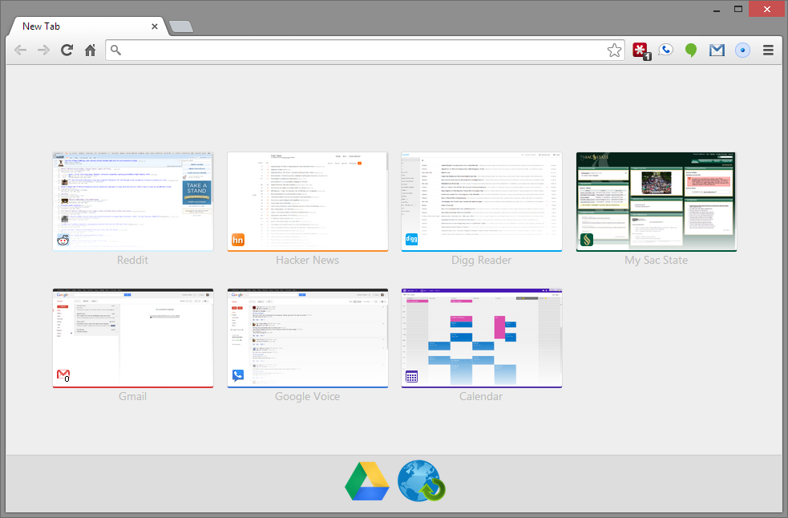

Speedy
======

A simple speed dial new-tab page replacement for Chrome.

Chrome's new tab page shows thumbnails of pages you frequently visit. Speedy lets you choose which pages want to see. Speedy gets these pages from a folder in your Bookmarks named "Speedy". Add a page to that folder and it will show up on your new tab page. The order of the bookmarks is the order in which Speedy displays them. It's that simple.

Speedy will automatically capture a screenshot of the page for the thumbnail the first time you click on it from the new tab page.